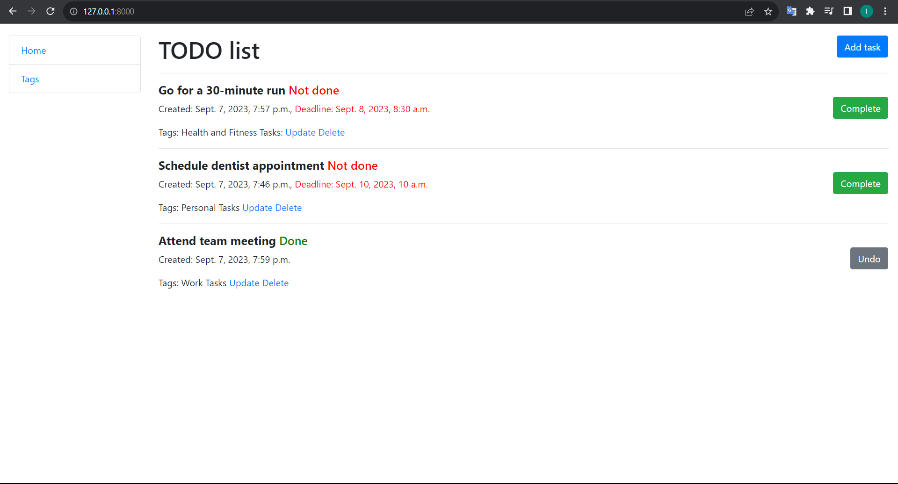

# TODO List

Django project for managing task and tags in your schedule

## Check it out

[TODO List deployed to Render](#)

## Installation

Python3 must be already installed

```shell
git clone -b develop https://github.com/IhorPokr/todo-list.git
cd todo-list
python -m venv venv
venv/Script/activate
pip install -r requirements.txt
python manage.py migrate # migrate
python manage.py runserver # starts Django Server
```

## Features

* Authentication functionality for Task
* Managing task and tags

## Demo

